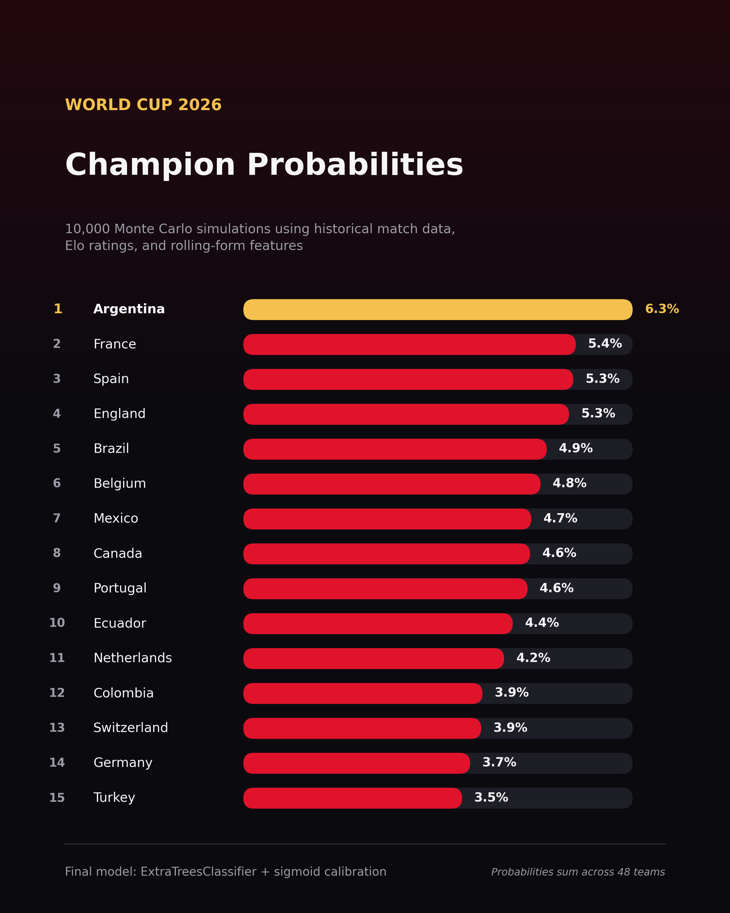
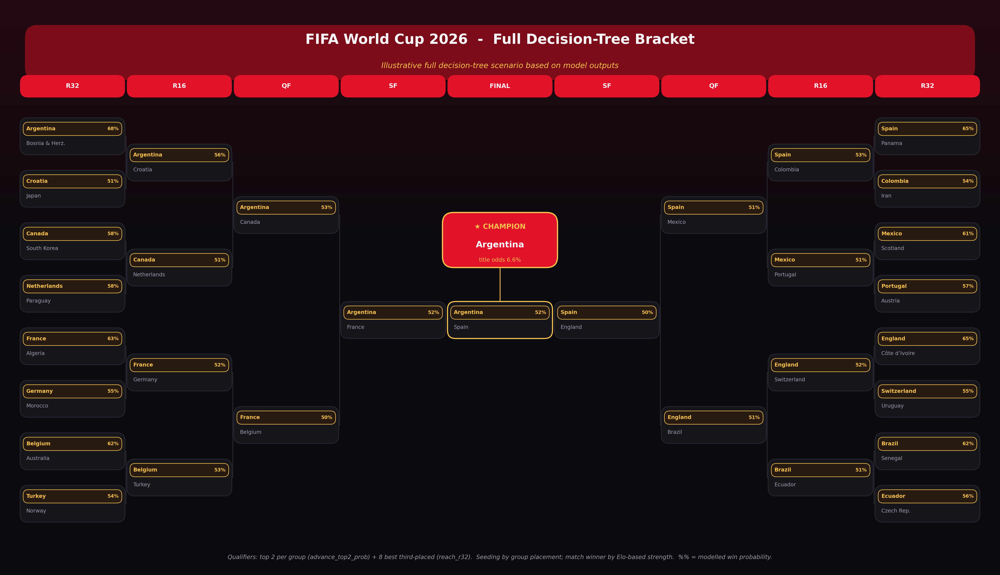
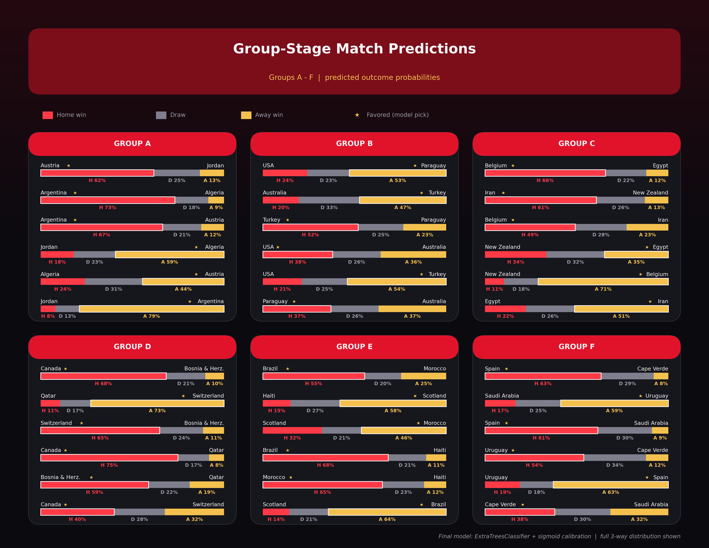
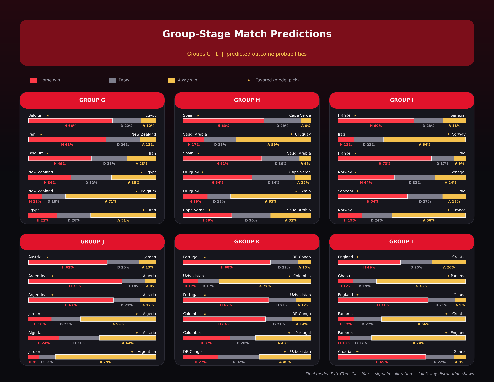
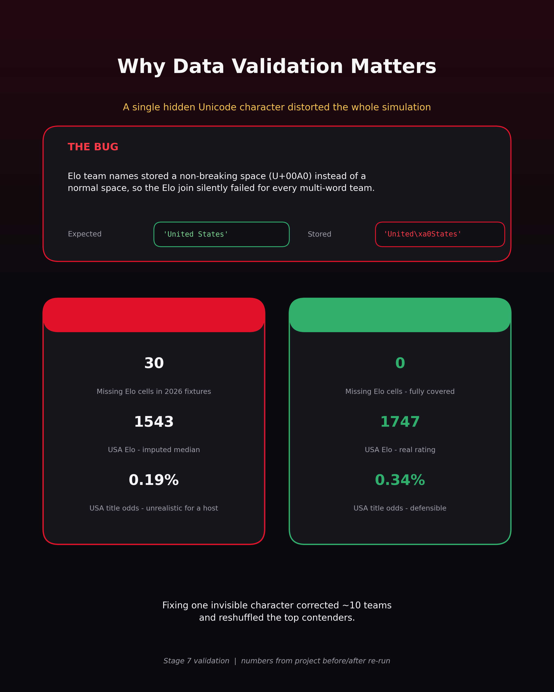
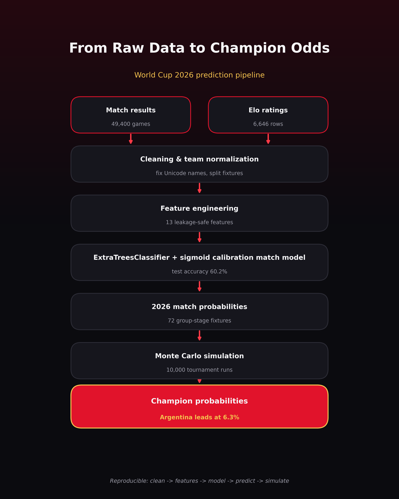

# World Cup 2026 Prediction

A reproducible, leakage-safe data + machine-learning pipeline that predicts
outcomes of the 2026 FIFA World Cup from historical international football data,
ending in per-team title probabilities and LinkedIn-ready visuals.

> **Status: Stage 10 complete — final deployment pipeline.**
> Final public-facing model: **ExtraTreesClassifier + sigmoid calibration**
> (60.2% holdout accuracy, log loss 1.641). End-to-end:
> clean → features → model → tune/calibrate → predict → simulate → visualize.

## Final model (TL;DR)

| Metric (2023–2025 holdout) | Stage 3 baseline (RF) | **Final (ExtraTrees + sigmoid)** |
|---|---:|---:|
| Accuracy | 58.5% | **60.2%** |
| Macro F1 | 0.508 | 0.457 |
| Log loss | 1.743 | **1.641** |

The final model raises accuracy **and** improves probability quality (lower log
loss), which is what the Monte Carlo simulation consumes. Full rationale in
[`report/final_model_summary.md`](report/final_model_summary.md) and
[`report/final_project_summary.md`](report/final_project_summary.md).

**Top 5 title contenders (final model, 10,000 sims):** Argentina 6.3% · France
5.4% · Spain 5.3% · England 5.3% · Brazil 4.9%.

## Results & visuals

All graphics below are generated from real project outputs by
`src/linkedin_visuals.py` (300 DPI). Footer label: *"Final model:
ExtraTreesClassifier + sigmoid calibration."* Group-stage cards use the
**official FIFA 2026 A–L group letters** (mapped via each group's Pot 1 seed).

### 1. Champion probabilities



### 2. Full decision-tree bracket

> *Illustrative simulation scenario based on model outputs — not a deterministic prediction.*



### 3. Group-stage match predictions

Full 3-way probability distribution per fixture (red = home win, gray = draw,
gold = away win); the model's favored side is flagged with a gold star.





### 4. Why data validation matters (the Unicode bug)



### 5. Pipeline overview



> Regenerate everything with `python -m src.finalize` (writes to
> `outputs/final_linkedin_visuals/`).

## Project structure

```
worldcup-2026-prediction/
├── data/
│   ├── raw/         # original, immutable CSVs (source of truth)
│   ├── interim/     # cleaned, split datasets (Stage 1 output)
│   └── processed/   # model-ready feature tables
├── notebooks/       # 01..07 stage notebooks
├── src/
│   ├── config.py          # paths & shared constants
│   ├── ingest.py          # load raw CSVs + parse dates + name normalization
│   ├── clean.py           # split/clean datasets, write interim artifacts
│   ├── features.py        # leakage-safe feature engineering (Stage 2)
│   ├── modeling.py        # baseline match-outcome models (Stage 3)
│   ├── modeling_stage9.py # stronger models, tuning, calibration (Stage 9)
│   ├── predict_2026.py    # 2026 fixture probability prediction (Stage 4)
│   ├── simulation.py      # Monte Carlo tournament simulation (Stage 5)
│   ├── linkedin_visuals.py# presentation visuals (Stage 8, parameterized)
│   └── finalize.py        # final deployment pipeline (Stage 10)
├── outputs/
│   ├── *.csv / *.pkl / *.png          # stage 3–5 artifacts
│   ├── model_results_stage9.csv ...   # stage 9 model comparison
│   ├── final_match_model.pkl          # FINAL model bundle
│   ├── final_*_probabilities.csv      # FINAL simulation outputs
│   ├── linkedin_visuals/              # Stage 8 visuals
│   └── final_linkedin_visuals/        # FINAL visuals (Stage 10)
├── report/          # validation notes + final summaries
├── requirements.txt
└── README.md
```

## Datasets (`data/raw/`)

| file | description |
|---|---|
| `results.csv` | international match results 1872–2026 (incl. unplayed WC 2026 fixtures) |
| `goalscorers.csv` | per-goal records (cleaned, **not** used as a predictive feature yet) |
| `shootouts.csv` | penalty shootout outcomes |
| `eloratings.csv` | team Elo ratings over time (mixed date formats — repaired on load) |
| `former_names.csv` | historical → current country name mapping (date-bounded) |

## Stage 1: what the pipeline does

1. **Load** all raw CSVs with correct date parsing.
2. **Repair Elo dates** — `eloratings.csv` mixes ISO (`YYYY-MM-DD`) and US
   (`M/D/YYYY`) formats; `ingest.parse_mixed_dates` handles both.
3. **Split `results.csv`** into:
   - `results_played` — matches with known scores (training history),
   - `fixtures_2026` — unplayed future matches with missing scores (targets).
4. **Clean Elo** — drop null ratings, drop `rating == 0`, sort by team & date.
5. **De-duplicate** all tables and apply light type fixes.
6. **Summarize** every dataset (rows, columns, nulls, dupes, date range).
7. **Persist** cleaned tables to `data/interim/` as Parquet, plus
   `dataset_summary.csv`.

## Setup

```bash
python3 -m venv .venv
source .venv/bin/activate
pip install -r requirements.txt
```

## Run Stage 1

```bash
python -m src.clean
```

Outputs are written to `data/interim/`:

```
results_played.parquet
fixtures_2026.parquet
eloratings_clean.parquet
goalscorers_clean.parquet
shootouts_clean.parquet
former_names_clean.parquet
dataset_summary.csv
```

For interactive inspection, open `notebooks/01_data_inspection.ipynb`.

## Stage 2: feature engineering

```bash
python -m src.features
```

Builds a leakage-safe feature table from the interim files and writes:

```
data/processed/train_features.parquet           # played matches + targets
data/processed/fixtures_2026_features.parquet   # WC 2026 fixtures (no targets)
```

Features produced:

- **Targets** (train only): `home_win`, `draw`, `away_win` (+ `result`).
- **Elo** (temporal as-of, *strictly* pre-match): `home_elo`, `away_elo`, `elo_diff`.
- **Rolling last-5 form** (only matches before the current one): per-side
  `winrate`, `goals_for`, `goals_against`, `goal_diff`.
- **Context**: `neutral`, `tournament_weight`.

Leakage safeguards: as-of joins use `allow_exact_matches=False`; rolling form is
shifted/as-of so the current match is excluded; the Elo `change` column and
current-match goals are never used as inputs. See
`notebooks/02_feature_engineering.ipynb` for the verification checks.

## Stage 3: match outcome model

```bash
python -m src.modeling
```

Trains **Logistic Regression** and **Random Forest** to predict the 3-way
outcome (home_win / draw / away_win) using only `config.MODEL_FEATURES`.

- **Split**: strictly chronological — train `2010-01-01..2022-12-31`,
  test `2023-01-01..2025-12-31`. 2026 fixtures are never used here.
- **Missing values**: Elo missingness indicators + median imputation fit on the
  train split only.
- **Metrics**: accuracy, macro-F1, log loss, confusion matrix.
- **Best model**: chosen by lowest log loss (probability quality matters for the
  later simulation).

Outputs:

```
outputs/model_results.csv        # model comparison table
outputs/confusion_matrix.png     # best-model confusion matrix (test)
outputs/best_match_model.pkl     # best model + preprocessing state
```

See `notebooks/03_model_training.ipynb`.

## Stage 4: predict 2026 fixture probabilities

```bash
python -m src.predict_2026
```

Loads `outputs/best_match_model.pkl` and `data/processed/fixtures_2026_features.parquet`,
re-applies the **exact** Stage 3 preprocessing (stored in the model bundle:
feature list, Elo missingness indicators, train medians, class order), and
predicts `P_home_win`, `P_draw`, `P_away_win` for every fixture.

Output:

```
outputs/fixtures_2026_predictions.csv
```

The pipeline prints the first 10 predictions, highest-confidence matches, most
balanced matches, and the average predicted draw probability. No training, no
actual 2026 scores, no simulation. See `notebooks/04_predict_2026_fixtures.ipynb`.

## Stage 5: Monte Carlo tournament simulation

```bash
python -m src.simulation
```

Runs **10,000** simulations (fixed seed) of the full 48-team tournament from the
Stage 4 fixture probabilities and estimates per-team group-winner, advancement,
round-reach, and champion probabilities.

- **Groups** are reconstructed from the fixture pairings (connected components):
  12 groups of 4, then labelled with the **official FIFA A–L letters** by
  matching each group to its Pot 1 seed (`config.OFFICIAL_GROUP_SEEDS`).
- **Group stage**: each of the 72 fixtures is sampled directly from its predicted
  `[P_home_win, P_draw, P_away_win]` (win = 3 pts, draw = 1, loss = 0).
- **Ranking**: points → goal-difference *approximation* (+1 win / 0 draw /
  −1 loss accumulated) → seeded random tie-break.
- **Advance**: top 2 per group (24) + 8 best third-placed teams = 32.
- **Knockout** (R32 → R16 → QF → SF → Final): matchup probabilities are derived
  from per-team **strength ratings** (mean win + ½ mean draw probability across a
  team's group fixtures). Each match samples win/draw/loss; a sampled draw is
  resolved by the two teams' normalized win probabilities.

Outputs:

```
outputs/champion_probabilities.csv       # team, group, champion_prob
outputs/advancement_probabilities.csv    # group-winner, top-2, and reach_* probs
outputs/champion_probabilities.png       # top-15 chart (from the notebook)
```

Internal consistency is verified: champion probs sum to 1, finalists to 2,
semifinalists to 4, R32 to 32, top-2 advancers to 24, group winners to 12.
See `notebooks/05_tournament_simulation.ipynb`.

### Simplified-bracket limitation

The simulation does **not** replicate FIFA's exact 2026 position-based rule for
mapping the 8 best third-placed teams into specific Round-of-32 slots (that
mapping depends on *which* groups the qualifying thirds come from, via a fixed
lookup table). Instead, all 32 qualifiers are seeded by group-stage performance
(points → GD approximation → strength → seeded jitter) and placed into a
**standard balanced single-elimination bracket** so that top seeds are spread
across the tree. Likewise, knockout matchup probabilities use derived strength
ratings rather than fresh model inference, because the trained model's
fixture-level predictions only cover the group stage. These are deliberate,
transparent simplifications; replacing them with the official slotting table and
per-pair model features is a possible future enhancement.

## Stage 6: validation & sanity checks

Read-only review of the Stage 1–5 outputs (no retraining, no re-simulation).
See `notebooks/06_validation_and_sanity_checks.ipynb` and the write-up in
`report/model_validation_notes.md`.

**What looks reasonable**: contender set and group orderings; correct
neutral/home flagging (only the 3 hosts' group games are non-neutral); very high
agreement with Elo expectations (r ≈ 0.97); fair bracket (champion odds track
strength, r = 0.955, with no spurious easy paths).

## Stage 7: Elo team-name fix (resolved)

**The bug**: `eloratings.csv` stored multi-word team names with the non-breaking
space `U+00A0` (e.g. `"United\xa0States"`), so the Elo as-of join silently failed
for every multi-word team. ~10 teams (United States, South Korea, Czech Republic,
Ivory Coast, …) were median-imputed and under-rated — most visibly the **USA**,
which collapsed to a ~0.2% title chance despite being a host. (Found in Stage 6;
see `report/model_validation_notes.md`.)

**The fix**: `src/ingest.py` now normalizes all team-name columns on load —
replace `U+00A0` → space, collapse/trim whitespace, then apply an alias map
(`src/config.TEAM_ALIASES`: `Czechia↔Czech Republic`,
`Democratic Republic of Congo↔DR Congo`, `Korea Republic↔South Korea`,
`Türkiye↔Turkey`, `USA↔United States`). Stages 1→5 were re-run.

**Updated results** (full comparison in `report/stage7_name_fix_comparison.md`):

- Missing Elo in `fixtures_2026_features`: **30 cells → 0** (all 48 teams covered).
- USA Elo corrected 1543 (imputed) → **1747** (real); USA title prob 0.19% → 0.34%.
- Top-15 reshuffled: Spain 9→2, Germany 10→3, Mexico 11→5; Ecuador entered, Japan
  left. Current top 5: Argentina 6.3%, Spain 5.9%, Germany 5.3%, England 5.2%,
  Mexico 4.9%.
- No 2026 teams remain with missing Elo.

## Stage 8: LinkedIn visuals

```bash
python -m src.linkedin_visuals
```

Generates five dark-red, World-Cup-themed infographics (six PNGs) at 300 DPI in
`outputs/linkedin_visuals/`, built only from real project outputs:

- `champion_probabilities_top15.png` — hero bar chart (carousel cover)
- `group_stage_match_cards_A_F.png`, `group_stage_match_cards_G_L.png` — match
  cards showing the full 3-way probability distribution per fixture
- `most_likely_tournament_path.png` — illustrative champion's-road bracket path
- `full_decision_tree_bracket.png` — full mirrored 32-team decision-tree bracket
  (R32 → R16 → QF → SF → Final → Champion), qualifiers by group placement, then
  Elo/champion strength as secondary ordering
- `pipeline_summary.png` — project flow diagram
- `validation_bug_fix.png` — the Stage 7 Unicode bug story

Design is inspired by (not copied from) the references in `assets/reference/`.
See `notebooks/07_linkedin_visuals.ipynb`.

## Stage 9: model improvement (leakage-safe)

```bash
python -m src.modeling_stage9
```

Pushes beyond the Stage 3 Random Forest while keeping strictly chronological
validation. Adds **GradientBoosting, HistGradientBoosting, ExtraTrees, and a
tuned RandomForest** (XGBoost optional if installed), each tuned with
`GridSearchCV` + `TimeSeriesSplit` on **training data only** (`neg_log_loss`),
plus a normal-vs-balanced class-weight experiment and probability calibration
(sigmoid + isotonic via `TimeSeriesSplit`).

Key findings: uncalibrated tree models are overconfident (log loss > the
uniform-guess 1.099); **sigmoid (Platt) calibration is the real lever**, cutting
log loss from ~1.69 to ~1.55–1.64. `balanced` class weights are the only way to
make the model predict draws (draw recall 0.02 → 0.33) at an accuracy cost.

Outputs: `outputs/model_results_stage9.csv`, `outputs/best_match_model_stage9.pkl`,
`outputs/confusion_matrix_stage9.png`. (Stage 3 artifacts are **not** overwritten.)

## Stage 10: final deployment

```bash
python -m src.finalize
```

Promotes the chosen **public-facing** model — `ExtraTreesClassifier + sigmoid
calibration` (Stage 9's highest-accuracy *and* calibrated candidate) — to a final,
reproducible deployment. Everything uses the `final_` naming convention so no
earlier-stage output is overwritten.

**Final metrics (2023–2025 holdout):** accuracy **60.2%**, macro F1 0.457,
log loss **1.641** (vs Stage 3: 58.5% / 0.508 / 1.743 → **+1.7pp accuracy,
−0.10 log loss**).

Final artifacts:

```
outputs/final_match_model.pkl                  # final model + preprocessing state
outputs/final_model_metrics.csv                # final vs baseline metrics
outputs/final_confusion_matrix.png
outputs/final_fixtures_2026_predictions.csv    # 72 group-stage fixtures
outputs/final_champion_probabilities.csv
outputs/final_advancement_probabilities.csv
outputs/final_linkedin_visuals/*.png           # 6 final visuals
report/final_model_summary.md
report/final_project_summary.md
```

The final visuals (footer: *"Final model: ExtraTreesClassifier + sigmoid
calibration"*) are: `champion_probabilities_top15.png`,
`full_decision_tree_bracket.png`, `group_stage_match_cards_A_F.png`,
`group_stage_match_cards_G_L.png`, `pipeline_summary.png`, `validation_bug_fix.png`.

## GitHub showcase

A compact tour of what this repo demonstrates:

- **End-to-end ML engineering** — raw CSVs → cleaning → leakage-safe features →
  model selection/tuning/calibration → probabilistic predictions → Monte Carlo
  simulation → publication-quality visuals.
- **Rigorous leakage prevention** — temporal as-of joins, `shift`-based rolling
  form, strictly chronological splits, train-only imputation, `TimeSeriesSplit`
  tuning, and 2026 fixtures kept out of training entirely.
- **A real data-quality save** — the Stage 7 non-breaking-space (`U+00A0`) bug
  that silently broke the Elo join for multi-word teams; finding and fixing it
  materially changed the results (see `validation_bug_fix.png`).
- **Calibration matters** — Stage 9 shows accuracy alone is misleading on a
  draw-heavy 3-way task; sigmoid calibration is what makes the probabilities
  (and therefore the simulation) trustworthy.
- **Communication** — six LinkedIn-ready infographics built only from real
  project outputs.

**Best images to feature:** `outputs/final_linkedin_visuals/champion_probabilities_top15.png`
(cover) and `full_decision_tree_bracket.png` (the headline artifact).

Suggested LinkedIn carousel order: **1)** champions hero → **2)** full bracket →
**3–4)** group match cards A–F / G–L → **5)** validation bug-fix story →
**6)** pipeline summary.

> All brackets are labelled *"Illustrative simulation scenario based on model
> outputs"* — they show a defensible scenario, not a deterministic prediction.

## Reproduce the whole pipeline

```bash
python -m src.clean          # Stage 1  clean & split
python -m src.features       # Stage 2  feature engineering
python -m src.modeling       # Stage 3  baseline models
python -m src.predict_2026   # Stage 4  2026 fixture probabilities
python -m src.simulation     # Stage 5  Monte Carlo simulation
python -m src.linkedin_visuals  # Stage 8  presentation visuals
python -m src.modeling_stage9   # Stage 9  model improvement experiments
python -m src.finalize          # Stage 10 final deployment (final_* artifacts)
```
